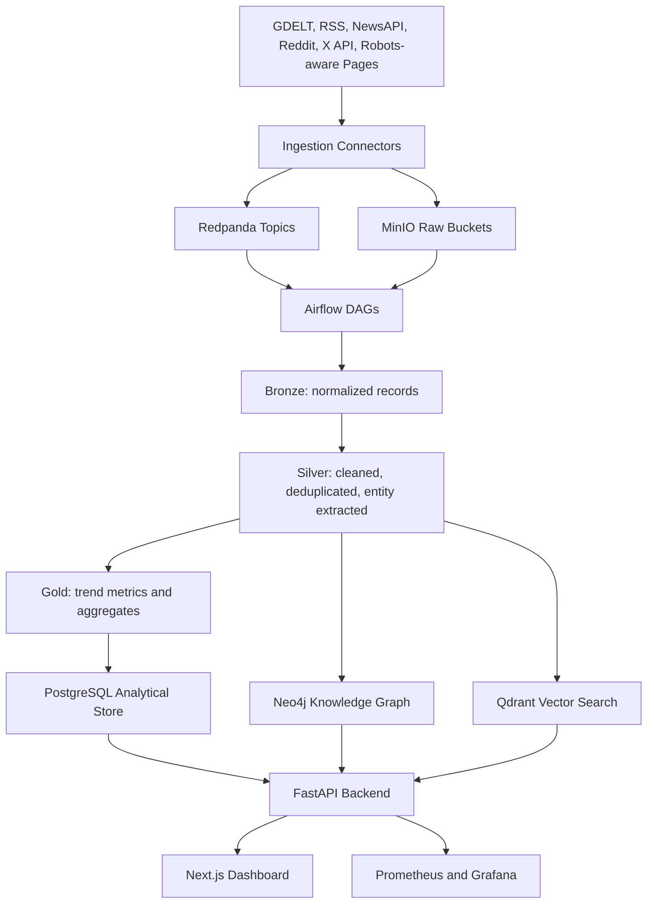

# Apple News Intelligence Platform

A production-style Data Engineering and MLOps portfolio project that collects Apple-related news and social discussion, processes it through lakehouse-style data layers, loads analytical stores, builds a Neo4j knowledge graph, indexes Qdrant vectors, and serves a FastAPI + Next.js dashboard.

The project is designed to run without paid API keys by using deterministic sample data. When credentials and network access are available, it can ingest from legal/public sources such as GDELT, RSS feeds, Reddit, and X/Twitter API v2.

## Architecture



## Tech Stack

- Ingestion: Python, GDELT DOC API, RSS, Reddit API/PRAW, X API v2, optional robots-aware public page fetcher
- Streaming: Redpanda-compatible Kafka topics
- Lakehouse: MinIO buckets for raw, bronze, silver, gold, and model artifacts
- Processing: Python cleaning, dedupe, entity extraction, sentiment, topic assignment, trend scoring
- Transformations: dbt models for analytical Postgres views/tables
- Analytical store: PostgreSQL
- Graph: Neo4j
- Vector database: Qdrant with `sentence-transformers/all-MiniLM-L6-v2` by default
- API: FastAPI
- Dashboard: Next.js, Tailwind CSS, Recharts, Cytoscape.js
- Orchestration: Apache Airflow
- Monitoring: Prometheus, Grafana, Docker health checks
- Testing: pytest

## Compliance

This project does not scrape Apple News. It uses legal/public sources:

- GDELT DOC API
- Publisher RSS feeds
- Reddit API/PRAW or Reddit public JSON fallback
- X/Twitter API v2 only when `X_BEARER_TOKEN` exists
- Optional public page fetching only after checking `robots.txt`

Credentials are optional. If API keys are absent, `scripts/seed_sample_data.py` and `scripts/run_pipeline_once.py` generate realistic sample data.

## Project Structure

```text
apple-news-intelligence-platform/
├── airflow/dags/
├── backend/
├── dbt/
├── frontend/
├── infra/
├── notebooks/
├── scripts/
├── src/
├── tests/
├── data/sample/
├── data/exports/
├── .env.example
├── requirements.txt
├── pyproject.toml
├── Makefile
├── README.md
└── architecture.md
```

## Local Setup on Windows

For Windows PowerShell as Administrator:

```powershell
wsl --install -d Ubuntu-24.04
wsl --set-default-version 2
wsl -l -v
```

Install Docker Desktop:

```powershell
winget install Docker.DockerDesktop
```

Install Git:

```powershell
winget install Git.Git
```

Optional VS Code:

```powershell
winget install Microsoft.VisualStudioCode
```

After Docker Desktop is installed:

- Open Docker Desktop
- Go to Settings
- Enable WSL 2 backend
- Enable integration with Ubuntu

Inside Ubuntu WSL:

```bash
sudo apt update && sudo apt upgrade -y
sudo apt install -y git curl wget unzip build-essential make jq python3 python3-pip python3-venv
```

Install Node.js and npm using nvm:

```bash
curl -o- https://raw.githubusercontent.com/nvm-sh/nvm/master/install.sh | bash
source ~/.bashrc
nvm install --lts
node -v
npm -v
```

Clone and run the project:

```bash
git clone <repo-url>
cd apple-news-intelligence-platform
```

Create Python environment:

```bash
python3 -m venv .venv
source .venv/bin/activate
pip install --upgrade pip
pip install -r requirements.txt
```

Create environment file:

```bash
cp .env.example .env
```

Start infrastructure:

```bash
cd infra
docker compose up -d
```

Check containers:

```bash
docker ps
```

## Service URLs

- Neo4j Browser: [http://localhost:7474](http://localhost:7474)
- Neo4j Bolt: `bolt://localhost:7687`
- Qdrant: [http://localhost:6333](http://localhost:6333)
- MinIO: [http://localhost:9001](http://localhost:9001)
- PostgreSQL: `localhost:5432`
- Airflow: [http://localhost:8080](http://localhost:8080), user `admin`, password `admin`
- Backend API docs: [http://localhost:8000/docs](http://localhost:8000/docs)
- Frontend dashboard: [http://localhost:3000](http://localhost:3000)
- Prometheus: [http://localhost:9090](http://localhost:9090)
- Grafana: [http://localhost:3001](http://localhost:3001), user `admin`, password `admin`

## Common Commands

```bash
make install
make up
make down
make logs
make test
make lint
make format
make seed
make run-once
make init-neo4j
make init-qdrant
make backend
make frontend
```

Run a local sample pipeline:

```bash
make seed
SKIP_GRAPH_LOAD=true SKIP_VECTOR_INDEX=true make run-once
```

Run the full pipeline against local Docker services:

```bash
make up
make run-once
```

## Environment Variables

Copy `.env.example` to `.env`. Important variables:

- `POSTGRES_*`: analytical store credentials
- `NEO4J_*`: graph database connection
- `QDRANT_URL`: vector database endpoint
- `MINIO_*`: object storage connection and bucket names
- `REDDIT_CLIENT_ID`, `REDDIT_CLIENT_SECRET`: optional Reddit API credentials
- `X_BEARER_TOKEN`: optional X/Twitter API v2 credential
- `NEWS_API_KEY`: optional NewsAPI key
- `EMBEDDING_PROVIDER`: `local`, `hash`, or `openai`
- `LOCAL_EMBEDDING_MODEL`: local sentence-transformer model
- `OPENAI_API_KEY`: optional OpenAI embeddings key

## Data Model

PostgreSQL tables:

- `articles`
- `publishers`
- `authors`
- `article_entities`
- `article_topics`
- `social_posts`
- `social_engagement`
- `trend_metrics`
- `sentiment_scores`
- `ingestion_runs`

MinIO buckets:

- `raw-news`
- `raw-social`
- `bronze`
- `silver`
- `gold`
- `model-artifacts`

Neo4j nodes:

- `Article`, `Publisher`, `Author`, `Topic`, `Product`, `Person`, `Company`, `Country`, `SocialPost`, `Hashtag`, `Event`

Neo4j relationships:

- `PUBLISHED_BY`, `WRITTEN_BY`, `MENTIONS`, `RELATED_TO`, `LOCATED_IN`, `DISCUSSES`, `USES`, `ASSOCIATED_WITH`, `TRENDING_WITH`

Qdrant collections:

- `article_embeddings`
- `headline_embeddings`
- `social_post_embeddings`

## Trend Score

The gold trend score is intentionally explainable:

```text
trend_score =
  article_volume_score
+ social_volume_score
+ engagement_score
+ positive_sentiment_momentum
+ recency_score
```

The implementation lives in `src/processing/trend_calculator.py`.

## Airflow DAGs

- `ingest_news_daily`
- `ingest_social_hourly`
- `process_bronze_to_silver`
- `build_gold_metrics`
- `update_neo4j_graph`
- `update_qdrant_embeddings`
- `calculate_trends`

## API Endpoints

- `GET /health`
- `GET /news/latest`
- `GET /news/trending`
- `GET /publishers/top`
- `GET /products/trending`
- `GET /social/buzz`
- `GET /sentiment/timeline`
- `POST /search/semantic`
- `GET /graph/product/{product_name}`
- `GET /graph/article/{article_id}`
- `GET /trends/timeseries`

## Screenshots

Place portfolio screenshots here after running the dashboard:

- `docs/screenshots/overview.png`
- `docs/screenshots/trends.png`
- `docs/screenshots/graph-explorer.png`
- `docs/screenshots/semantic-search.png`

## Cloud Deployment Notes

AWS:

- S3 instead of MinIO
- MSK or Kinesis instead of Redpanda
- RDS PostgreSQL
- Neo4j Aura or Neo4j on ECS/EKS
- Qdrant Cloud or Qdrant on ECS/EKS
- MWAA or self-managed Airflow
- ECS/EKS for API and frontend
- CloudWatch for logs
- Terraform for infrastructure

GCP:

- Cloud Storage
- Pub/Sub
- Cloud SQL for PostgreSQL
- Vertex AI embeddings optional
- GKE or Cloud Run
- Cloud Composer for Airflow
- Cloud Monitoring

Azure:

- ADLS Gen2
- Event Hubs
- Azure Database for PostgreSQL
- Container Apps or AKS
- Managed Grafana
- Azure Monitor

## Future Improvements

- Add NewsAPI connector once credentials are configured
- Add Bluesky ingestion
- Add event-level topic clustering with BERTopic
- Add Terraform modules for each cloud target
- Add CI pipeline with integration tests against Docker Compose
- Add role-based auth for the dashboard and API
